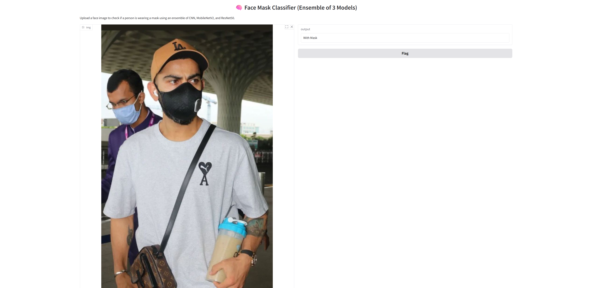
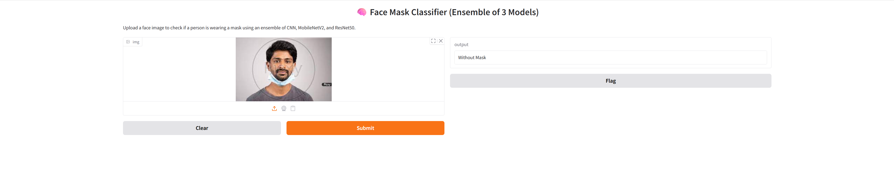

# 😷 Face Mask Classifier (CNN + MobileNetV2 + ResNet50 + Ensemble)

This is an end-to-end deep learning project that classifies whether a person is **wearing a face mask** or **not**.  
It compares multiple models and uses an **ensemble** for improved accuracy.

---

## 📸 Demo





---

## 🔍 Project Highlights

- ✅ Binary Image Classification: With Mask vs Without Mask
- 🧠 Models Used:
  - Simple CNN (custom)
  - MobileNetV2 (transfer learning)
  - ResNet50 (transfer learning)
- 🔁 Ensemble via averaged predictions
- 📊 Visualization: Accuracy, Loss curves, Confusion Matrix
- 🌐 Gradio App for real-time predictions

---
🚫 Note: Model files (`.h5`) are too large for direct GitHub upload.
✅ You can re-train them using the provided notebook.

<details>
<summary>📁 Dataset</summary>

- **Source:** [Kaggle - Face Mask Detection Dataset](https://www.kaggle.com/datasets/omkargurav/face-mask-dataset)
- **Classes:**
  - `with_mask`
  - `without_mask`
- **Structure:**
face-mask-dataset/data/
├── with_mask/
└── without_mask/

</details>

---

## 🧠 Model Comparison

| Model         | Validation Accuracy |
|---------------|---------------------|
| Simple CNN    | 95.5%               |
| MobileNetV2   | 95.5%               |
| ResNet50      | 61.8%               |
| **Ensemble**  | **🔥 Best**         |

---

## 🛠️ Tech Stack

- Python, TensorFlow, Keras
- Scikit-learn, Matplotlib, NumPy, Pillow
- Gradio (for web app UI)

---

## 🚀 How to Run the Project

```bash
# Clone the repo
git clone https://github.com/your-username/face-mask-classifier.git
cd face-mask-classifier

# (Optional) Create a virtual environment
python -m venv venv
venv\Scripts\activate   # or source venv/bin/activate on Mac/Linux

# Install required packages
pip install -r requirements.txt

# Open the notebook
# face_mask_ensemble_demo.ipynb
